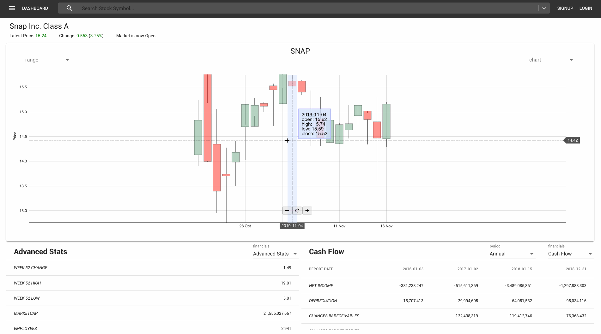

# Online Trading Platform
## Purpose
* This is my project to develop a full stack app by myself.
* It will be an online trading platform mainly for equities.
* Charts visualization and creation of personal portfolios is the first end goal.
* Implement machine learning to analyze stocks will be my 2nd end goal (not implemented currently).

## Demo

## How to run
1. Postgres is used in the production side
2. Run backend server
    * python manage.py runserver
3. Run Frontend server
    * npm start

## List of major technologies used
* Django
* React
* D3
* sqlite for development, and Postgres for production
* Django Rest Framework
* Redux
* Material-UI

